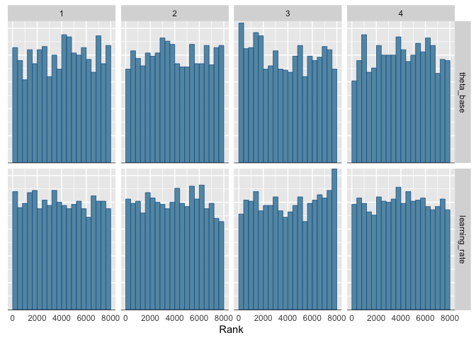
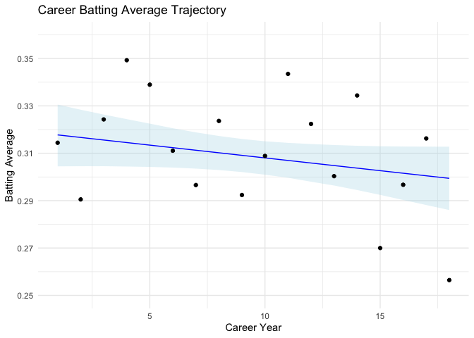

# Homework 8
Armin Bazarjani
2024-12-02

- [Research Question](#research-question)
- [Variables](#variables)
  - [Data Import](#data-import)
  - [Variable Summary](#variable-summary)
- [Model](#model)
  - [Analysis](#analysis)
- [Results](#results)
- [Future Plans](#future-plans)

# Research Question

> How does a player’s batting ability change over their career?

# Variables

- `playerID`: Player ID Code
- `yearID`: Year
- `stint`: player’s stint (order of appearances within a season)
- `teamID`: Team; a factor
- `H`: Number of hits in a season
- `AB`: Number of at-bats in a season

## Data Import

## Variable Summary

Table 1: Descriptive statistics of batting average by career year

|     | N   | Mean | SD   | Min  | Max  |
|-----|-----|------|------|------|------|
| BA  | 18  | 0.31 | 0.02 | 0.26 | 0.35 |

# Model

Model:

 \\
  \theta_i = & \theta_{\text{base}} + \text{learning\_rate} \times (Y_i - 1)
\end{aligned}")

Prior:

 \\
  \text{learning\_rate} & \sim N(0, 0.02) 
\end{aligned}")

## Analysis

I used 4 chains, each with 4,000 iterations (first 2,000 as warm-ups).

# Results

As shown in the rank histogram in
<a href="#fig-rank-hist-fit" class="quarto-xref">Figure 1</a> below, the
chains mixed well.

Figure 1: Rank histogram of the posterior distributions of model
parameters.

<a href="#tbl-summ-fit" class="quarto-xref">Table 2</a> shows the
posterior distributions of

(base batting average), learning_rate (yearly change), and predicted
batting averages for selected career years.

Table 2: Posterior summary of the model parameters.

| variable      |   mean | median |    sd |   mad |     q5 |   q95 |  rhat | ess_bulk | ess_tail |
|:--------------|-------:|-------:|------:|------:|-------:|------:|------:|---------:|---------:|
| Base BA       |  0.318 |  0.318 | 0.008 | 0.008 |  0.304 | 0.331 | 1.002 | 1817.731 | 1693.568 |
| Learning Rate | -0.001 | -0.001 | 0.001 | 0.001 | -0.002 | 0.000 | 1.001 | 2254.289 | 2275.201 |
| Year 1 BA     |  0.318 |  0.318 | 0.008 | 0.008 |  0.304 | 0.331 | 1.002 | 1817.731 | 1693.568 |
| Year 5 BA     |  0.313 |  0.314 | 0.006 | 0.006 |  0.304 | 0.323 | 1.002 | 2006.224 | 2137.741 |
| Year 10 BA    |  0.308 |  0.308 | 0.004 | 0.004 |  0.301 | 0.315 | 1.000 | 5522.569 | 5170.544 |

<a href="#fig-career-trajectory" class="quarto-xref">Figure 2</a> shows
the model’s estimates of the player’s (Derek Jeter) career batting
trajectory

Figure 2: Career batting average trajectory with 90% credible intervals

# Future Plans

After doing this initial analysis there are a few things I think that I
would like to do: 1. I could try using a non-linear learning rate
between seasons. 2. Try non-linear models for modeling career batting
averages 3. Add covariates, things like age, position, ballpark, etc. 4.
I would like to try a hierarchical model.
